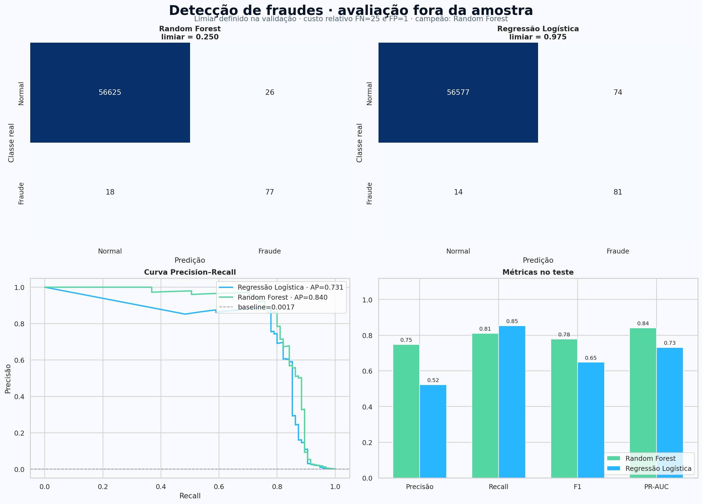
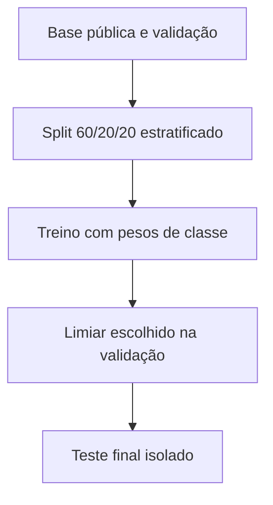

# Detecção de fraudes em cartões de crédito

Projeto de machine learning para identificar transações fraudulentas em uma base extremamente desbalanceada. O trabalho documenta o caminho completo: análise exploratória, preparação, comparação de modelos, seleção de limiar com custo relativo e avaliação final fora da amostra.

[](https://www.python.org/)
[](https://scikit-learn.org/)
[](https://jupyter.org/)
[](https://colab.research.google.com/github/williamlopes-ai/deteccao-fraudes-cartao-credito/blob/main/notebooks/deteccao-fraudes-cartao.ipynb)



## Problema de negócio

Fraude é um problema raro e assimétrico: deixar uma transação fraudulenta passar pode custar muito mais do que analisar um alerta legítimo, mas gerar alertas demais também cria atrito, custo operacional e perda de confiança.

Por isso, o objetivo não é maximizar acurácia. O projeto busca uma política que equilibre:

- **recall:** quantas fraudes foram encontradas;
- **precisão:** quantos alertas realmente eram fraudes;
- **F1:** equilíbrio entre precisão e recall;
- **PR-AUC:** qualidade do ranking para a classe rara;
- **custo relativo:** impacto combinado de falsos negativos e falsos positivos.

## Base de dados

O notebook carrega a base pública utilizada no tutorial [Classification on imbalanced data](https://www.tensorflow.org/tutorials/structured_data/imbalanced_data), do TensorFlow. O CSV é baixado durante a execução e **não é armazenado no repositório**.

Características da base original:

- 284.807 transações;
- 492 fraudes na base bruta;
- `Time`, `Amount`, `Class` e `V1` a `V28`;
- variáveis `V1`–`V28` anonimizadas por PCA.

Após a remoção de 1.081 duplicatas exatas, o experimento permaneceu com 283.726 transações e 473 fraudes, correspondentes a apenas **0,1667%** da amostra.

## Decisões do experimento



### Preparação

- remoção de duplicatas antes da divisão;
- verificação de colunas e valores ausentes;
- split estratificado em treino, validação e teste;
- `RobustScaler` para `Time` e `Amount` na Regressão Logística;
- transformações ajustadas somente com dados de treino;
- `random_state=42` para reprodutibilidade.

### Desbalanceamento

Foram utilizados pesos de classe em vez de criar observações sintéticas:

- Regressão Logística: `class_weight="balanced"`;
- Random Forest: `class_weight="balanced_subsample"`.

Undersampling e oversampling são alternativas válidas, mas não foram adicionados apenas para aumentar a quantidade de experimentos. O foco foi comparar dois modelos claros e justificar cada decisão com métricas adequadas.

### Limiar e custo

O limiar padrão de `0.5` não foi aceito automaticamente. Para cada modelo, o notebook procura na validação o limiar com menor custo relativo:

- falso negativo: **25**;
- falso positivo: **1**.

Essa proporção é didática, não representa o custo real de uma instituição. Em produção, os valores devem refletir perda financeira, esforço de investigação, experiência do cliente e apetite de risco.

## Resultados no conjunto de teste

| Modelo | Limiar | Precisão | Recall | F1 | ROC-AUC | PR-AUC | FP | FN |
| --- | ---: | ---: | ---: | ---: | ---: | ---: | ---: | ---: |
| Random Forest | 0,250 | 74,76% | 81,05% | 0,778 | 0,977 | 0,840 | 26 | 18 |
| Regressão Logística | 0,975 | 52,26% | 85,26% | 0,648 | 0,967 | 0,731 | 74 | 14 |

O **Random Forest foi selecionado na validação**, antes de abrir o teste. Ele apresentou menor custo de validação, maior PR-AUC e melhor equilíbrio entre precisão e recall.

No teste, a Regressão Logística teve recall maior e custo ilustrativo observado menor, mas produziu quase três vezes mais falsos positivos. Trocar o campeão depois de consultar o teste causaria viés de seleção. O resultado mostra que a decisão depende do custo real e precisa ser confirmada em novas janelas temporais.

## Por que a acurácia não decide este projeto?

Um modelo que classificasse todas as transações como normais teria aproximadamente **99,83% de acurácia** e não detectaria nenhuma fraude. Por isso, a análise prioriza matriz de confusão, recall, precisão, F1 e Precision–Recall.

A documentação do scikit-learn destaca a curva Precision–Recall como uma medida especialmente útil quando as classes são muito desbalanceadas.

## Minha decisão em relação à orientação do Expert

A orientação de comparar um modelo simples com um modelo não linear foi mantida:

- a Regressão Logística funciona como baseline interpretável;
- o Random Forest captura relações não lineares e interações;
- ambos usam exatamente as mesmas partições;
- o teste permanece isolado;
- o modelo é escolhido pela validação, não pela melhor métrica encontrada depois.

A principal diferença foi não adicionar cinco algoritmos ou técnicas de reamostragem sem necessidade. Duas abordagens bem avaliadas e uma política de limiar documentada contam uma história mais sólida do que vários modelos comparados apenas por acurácia.

## Estrutura do repositório

```text
deteccao-fraudes-cartao-credito/
├── images/
│   └── model-comparison.png
├── notebooks/
│   └── deteccao-fraudes-cartao.ipynb
├── .gitignore
├── README.md
└── requirements.txt
```

## Como executar

### Google Colab

Use o botão **Abrir no Colab** no início do README e execute **Runtime → Run all**.

### Ambiente local

```bash
git clone https://github.com/williamlopes-ai/deteccao-fraudes-cartao-credito.git
cd deteccao-fraudes-cartao-credito

python -m venv .venv
```

Ative o ambiente:

```bash
# Windows
.venv\Scripts\activate

# Linux ou macOS
source .venv/bin/activate
```

Instale as dependências e abra o notebook:

```bash
pip install -r requirements.txt
jupyter lab notebooks/deteccao-fraudes-cartao.ipynb
```

A primeira execução baixa aproximadamente 144 MB. O arquivo permanece fora do controle de versão.

## Reprodutibilidade e validação

- notebook executado do início ao fim com a base real;
- saídas e gráficos salvos no arquivo `.ipynb`;
- métricas reproduzidas em uma segunda execução integral;
- dados de teste não utilizados na escolha do modelo ou do limiar;
- dependências declaradas com intervalos de versões;
- dataset, modelos serializados e caches ignorados pelo Git.

## Limitações e uso responsável

- a divisão aleatória estratificada não substitui uma validação temporal;
- variáveis PCA limitam a interpretação de negócio;
- custos relativos precisam ser calibrados com a operação real;
- fraude muda com o tempo e exige monitoramento de drift;
- alertas automatizados devem possuir governança e revisão adequada;
- este projeto é educacional e não constitui um sistema antifraude produtivo.

## Referências

- [TensorFlow — Classification on imbalanced data](https://www.tensorflow.org/tutorials/structured_data/imbalanced_data)
- [scikit-learn — Precision–Recall](https://scikit-learn.org/stable/auto_examples/model_selection/plot_precision_recall.html)
- [scikit-learn — RandomForestClassifier](https://scikit-learn.org/stable/modules/generated/sklearn.ensemble.RandomForestClassifier.html)
- [scikit-learn — LogisticRegression](https://scikit-learn.org/stable/modules/generated/sklearn.linear_model.LogisticRegression.html)
- [scikit-learn — Common pitfalls](https://scikit-learn.org/stable/common_pitfalls.html)

## Autor

Desenvolvido por [William Lopes](https://github.com/williamlopes-ai) como projeto de portfólio em Dados, Inteligência Artificial e Machine Learning.
